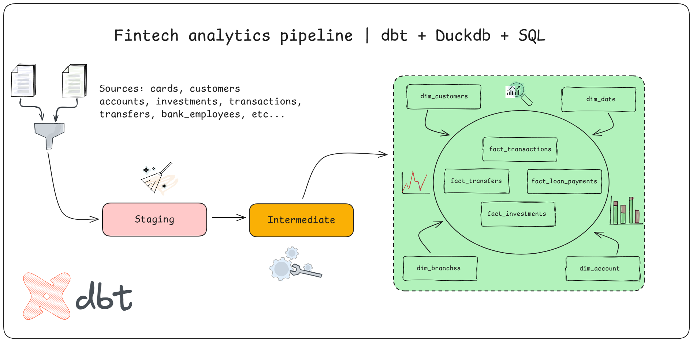

# FintechFlow Analytics - Modern Banking Data Platform

## Overview

Plataforma de modelado de datos para **FintechFlow**, una institución financiera digital de próxima generación. El sistema transforma datos transaccionales crudos (clientes, cuentas, préstamos e inversiones) en modelos analíticos refinados siguiendo una arquitectura de capas, garantizando la integridad financiera mediante tests automatizados y documentación continua.



**Stack:** Python 3.13+ (para entorno virtual) · dbt-duckdb · SQL · DuckDB

---

## Contexto 

Anteriormente se operaba con procesos financieros fragmentados mediante scripts SQL aislados, sin control de versiones ni validación de integridad transaccional. La falta de pruebas automáticas generaba discrepancias frecuentes en los balances de cuentas y reportes de riesgo crediticio.

En base a eso el objetivo fue migrar y centralizar toda la lógica de transformación bancaria a un entorno profesional bajo dbt, estableciendo una estructura robusta de pruebas y documentación para garantizar la integridad del 100% de las transacciones.

---

## Flujo y Arquitectura de Datos

El pipeline procesa la información a través de tres etapas estratégicas:

1. **Staging**: Limpieza inicial, tipado de datos y renombramiento de campos para asegurar consistencia técnica desde las fuentes crudas.
2. **Intermediate**: Capa donde reside la lógica de negocio pesada. Aquí se construyen tablas que enriquecen a las entidades consideradas como principales dentro del sistema (préstamos, clientes, transacciones, transferencias y empleados dentro de la institución)
3. **Marts**: Modelos finales optimizados para consumo en herramientas de BI. Incluye dimensiones históricas (SCD Tipo 2) para el seguimiento de cambios en perfiles de clientes y tablas de hechos para transacciones, préstamos e inversiones.

---

## Documentación

La ventaja de dbt es que la documentación de este proyecto es orgánica y vive exclusivamente dentro del código; si buscas la verdad, ejecuta los comandos:

```cmd
# Generar la documentación
dbt docs generate 

# Servir la documentación en un servidor local
dbt docs serve
```

---

## Ejecución del Proyecto

### Requisitos Previos

Asegúrate de tener instalado Python 3.13+ en tu máquina local. Luego ejecuta en la terminal el siguiente comando:

```cmd
pip install requirements.txt
```

Para este entorno se asume el uso de datos locales. Los archivos de origen deben estar en formato CSV y ubicarse obligatoriamente en el directorio de seeds, ya que dbt los procesará como fuentes base (sources) para el pipeline.

### Configuración del Perfil

Asegúrate de configurar tu archivo profiles.yml con la siguiente estructura para conectar con DuckDB:

```yaml
fintech_profile:
    target: dev
    outputs:
        dev:
            type: duckdb
            path: "fintech_flow.duckdb"
            threads: 4

```

### Comandos de Ejecución

Instalación de dependencias:
`dbt deps`

Carga de datos iniciales (seeds):
`dbt seed`

Construcción completa del pipeline y ejecución de tests:
`dbt build`

---

## Operación, logros y beneficios

* Reducción del 80% en bugs detectados en producción mediante el uso de tests preventivos en cada ejecución.
* Aceleración del 50% en el tiempo de desarrollo de nuevos modelos de riesgo gracias al uso de macros y lógica modular reutilizable.
* Optimización del tiempo de onboarding de nuevos analistas, reduciéndolo de dos semanas a dos días.

---

**Autor:** Gerardo Toboso · [gerardotoboso1909@gmail.com](mailto:gerardotoboso1909@gmail.com)

**Licencia:** MIT
